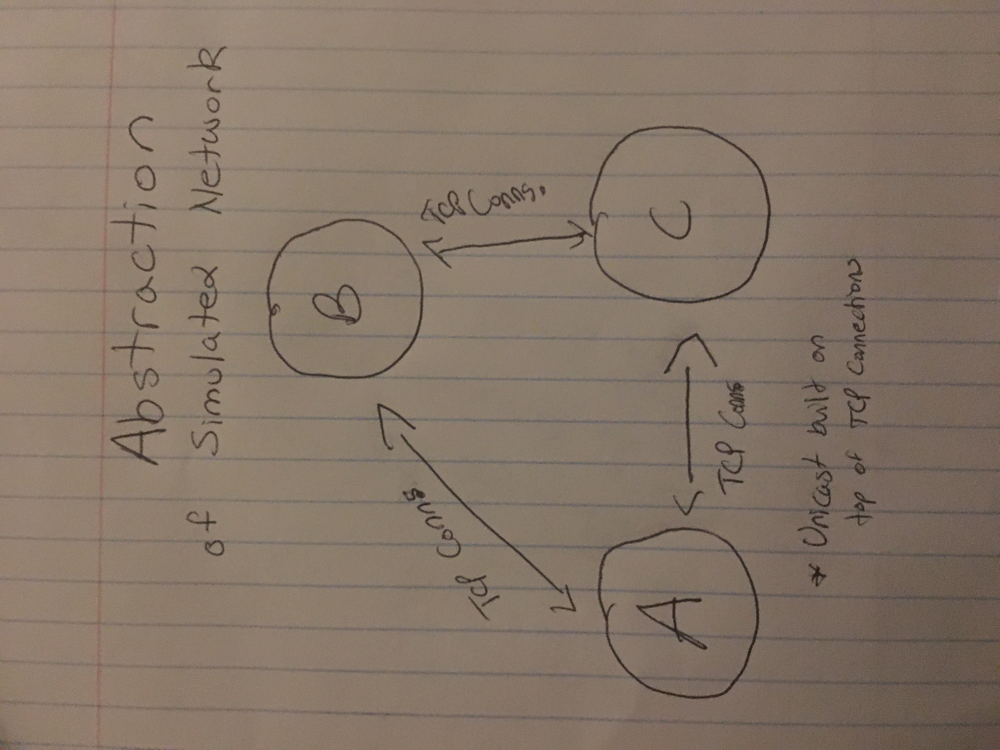

**MP1**

**Goal:** To Create a Simulated Network

**To Run**

Not currently runnable

**Structure and Design**

_Initialization_

Read Port and IP information from the config.txt file using bufio package

Use the extracted data from config.txt to create the servers

_Network Layer_

Create TCP Channels between servers
 
Use a global array variable to quickly and simply decide which TCP channel is used by a server

Example: In the diagram above, Server A would have an array [ConntoC, ConntoB] to choose its TCP channel from

Use Unicast_receive to grab messages from the application layer that should go across the TCP channels

Create a network delay between the TCP channel receiving the message from the application layer and sending it across the TCP channel to the destination in order to simulate a network

_Application Layer_

Use Unicast_send to send messages from the user to and from the specified servers in the network layer

Each message should be sent using a goroutine

Mutex is implemented to make sure no messages aren't corrupted by goroutines using the same resources